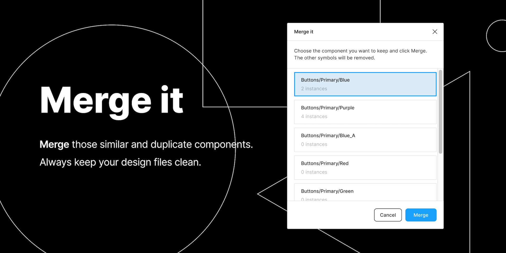

`Merge it` is a plugin that can let you merge those similar, duplicated, inconsistent style components in your design system.

How to use:
1. Select at least two components.
2. Run plugin.
3. Choose the component you want to keep (You will be relocated at each component position when selecting. It helps to find the one you want to keep).
4. Click Merge.
5. The other symbols will be removed, and all of their instances will be replaced by the one you chose to keep, keeping overrides whenever it is possible.
6. Enjoy!

## build tool
- figplug
- yarn